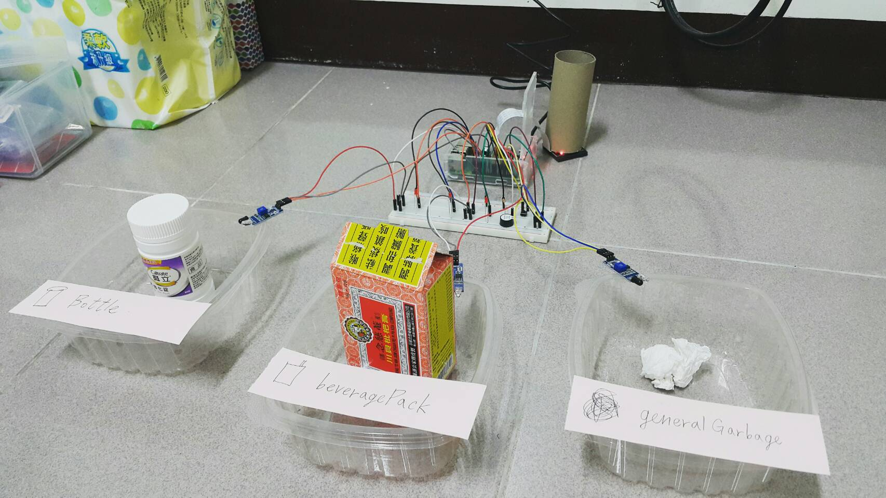

# Intelligent-Trash-Can



## Introduction

	This project is an 'Intelligent-Trash-Can' that can classify trash into three groups (bottle, beverage pack and general garbage).

	1.	When we press the switch button, it will trigger the camera to take a picture of trash. Because the camera connects to Pi, it will then send the picture to the cloud server. The cloud server will use tensorflow api to classify the image to one of the garbage groups.
	2.	If the cloud server cannot categorize the item, it will send an email with the image to us. We can classify the image by ourselves and return the result to the cloud server by replying to the email. The cloud server will return the result to Pi which will blink the corresponding LED light, telling the user which garbage group can be thrown.
	3.	If we also have difficulty categorizing the image, we can reply to the email with the word "Other." Then, the buzzer will ring.
	
## Demo Video

[Introduction](https://youtu.be/SRkfxMqJyuk)

[Operation](https://youtu.be/C6XysghJNQs)

	
## Requirement

	Cloud Server * 1
	Raspberry pi * 1
	Breadboard * 1
	Camera * 1
	LED lights * 3
	Buzzer * 1
	Jumper Cable * N
	
	
## Development Process

> **Cloud Server (x86_64 GNU/Linux 4.4.0-116-generic) (Ubuntu 16.04.4 LTS xenial)**

#### Install ssh

* sudo apt-get install openssh-server
* sudo systemctl restart ssh
* sudo ufw allow 22

  `// You can change the service port in /etc/ssh/sshd_config`

#### Install nfs-server

* sudo apt-get install nfs-kernel-server nfs-common

  `// Create group nfs and add user into the group`
* sudo groupadd -g 2049 nfs
* usermod -aG nfs {your-non-root-user}

  `// Reload group setting`
* Logout && Login 

* sudo mkdir -p /srv/nfs/IoT/code /srv/nfs/IoT/pictures /srv/nfs/IoT/picturesInfo
* sudo chown -R root:nfs /srv/nfs/IoT
* sudo chmod -R 775 /srv/nfs/IoT
* sudo vim /etc/exports

	```
	// Servers you want to share data with. (you can separate them with blank space.)<br/>
	// If your pi is after NAT, you should add insecure in the brackets in order to allow pi connect through ports greater than 1024. (rw,sync,no_root_squash,no_subtree_check,insecure) <br/><br/>
	/srv/nfs/IoT   x.x.x.x(rw,sync,no_root_squash,no_subtree_check)
	```

* sudo systemctl restart nfs-kernel-server
* sudo ufw allow 111 2049

  `// Bring up this service during server startup`
* sudo systemctl enable nfs-kernel-server

#### Install miniconda3 (Recommend run as non-root-user)

* cd ~
* wget https://repo.continuum.io/miniconda/Miniconda3-latest-Linux-x86_64.sh
* bash Miniconda3-latest-Linux-x86_64.sh

  `// You may export path by yourself by edit ~/.bashrc`
  `// You may edit /etc/environment if you want to set global PATH`
* Let miniconda3 auto export PATH for you.

* source .bashrc (reload .bashrc)

  `// [Check that if you are using the right python`
* which python

	```
	(Should see something like below)
	/home/{your-non-root-user}/miniconda3/bin/python
	```

* conda update conda
* pip install --upgrade pip

#### Install tensorflow (Run as non-root-user if you install miniconda3 as non-root user)

* pip install numpy tensorflow

  `// Check if those package were correctly installed`
* pip list | egrep '(numpy|tensorflow)'

	```
	(Should see something like below)
	numpy        1.14.3
	tensorflow   1.8.0
	```

  `// Clone tensorflow's models`
* sudo apt-get install git
* mkdir ~/tensorflow
* cd ~/tensorflow
* git clone https://github.com/tensorflow/models.git

  `// Check that if you can use tensorflow's models correctly`
* python ~/tensorflow/models/tutorials/image/imagenet/classify_image.py
	
	```
	Should get some tags and scores
	```
		
----------------------------------------------------------------------

> **Raspberry pi (armv7l GNU/Linux 4.14.34-v7+) (2017-11-29-raspbian-stretch-lite)**

* sudo apt-get update
* sudo apt-get dist-upgrade
* sudo apt-get autoremove
* sudo vim /etc/hosts
	
	```
	if (you have static ip) {

		127.0.0.1       localhost
		your-static-ip  {your-fqdn-name} {your-host-name}

	} else {

		127.0.0.1       localhost
		127.0.1.1       {your-fqdn-name} {your-host-name}

	}
	```

  `// Edit host name`
* sudo vim /etc/hostname

  `// Edit network setting`
* sudo vim /etc/network/interfaces
	
	```
	if(you want to connect to internet via wifi) {

		auto wlan0
		iface wlan0 inet (static || dhcp)
		wpa-conf /etc/wpa_supplicant/wpa_supplicant.conf

		// Set the connection info
		* vim /etc/wpa_supplicant/wpa_supplicant.conf

			network={
				ssid="{AP-name}"
				psk="{AP-password}"
				priority=1 (raspberry pi will try to connect to the highest priority(largest number) AP first.)
				id_str="{AP-info}"
			}


		// Sometime Pi won't connect to internet via wifi after startup, but we can auto re-bring-up the wifi interface or restart networking service right after startup to solve this problem. <br/>
		* vim /etc/rc.local

			// add one of this at the bottom right before exit 0.
			1. ifdown wlan0 && ifup wlan0
			2. systemctl restart networking


		// You can scan the available AP using this command.
		* iwlist wlan0 scan

	} else {

		auto eth0
		iface eth0 inet (static || dhcp)
		address x.x.x.x
		netmask 255.255.255.0
		gateway x.x.x.x
		dns-nameservers x.x.x.x x.x.x.x

	}
	```
		
* sudo reboot

  `// Check host name`
* hostname -f => fqdn-name
* hostname -s => host-name

  `// Check network status`
* ping 8.8.8.8

#### Install ssh
* sudo apt-get install openssh-server
* sudo systemctl restart ssh	

  `// [Run as non-root-user, do not run as Root!` <br/>
  `// [Create RSA keys and copy public key to cloud server, then we can login to cloud server using private key. (don't need to enter password while using ssh or scp)`
* ssh-keygen -t rsa

	```
	Press enter three time for default setting (use empty passphrase)
	```
	
  `// Copy public key to cloud server (~/.ssh/authorized_keys)`
* cd ~/.ssh
* ssh-copy-id -i id_rsa.pub colud-server-user@colud-server-ip -p colud-server-ssh-port

  `// You can now login in to cloud server without password after typing below command`
* ssh colud-server-user@colud-server-ip -p colud-server-ssh-port
	
#### Install nfs-client
* sudo apt-get install nfs-common
* sudo mkdir =p /mnt/nfs/IoT

  `// Check that if you are in remote-server's export list`
* showmount -e colud-server-ip	
* sudo mount -t nfs colud-server-ip:/srv/nfs/IoT /mnt/nfs/IoT
		
  `// Check that if you are correctly connect to network file system server`
* df -h | grep /mnt/nfs/IoT

	```		
	// should show something like this.
	remote-server-ip:/srv/nfs/IoT   28G  6.4G   21G  25% /mnt/nfs/IoT
	```
		
  `// If you want to auto mount on startup`
* sudo vim /etc/fstab

	```
	remote-server-ip:/srv/nfs/IoT /mnt/nfs/IoT nfs defaults 0 0
	```	
		
* sudo groupadd -g 2049 nfs

  `// Add user to nfs group`
* sudo usermod -aG nfs {your-non-root-user}
* logout && login (refresh the group setting)
		
  `// Check point`
* ls -ld /mnt/nfs/IoT

	```
	drwxrwxr-x 3 root nfs 4096 Jun 12 02:31 /mnt/nfs/IoT
	```

#### Install berryconda3 (recommend run as non-root-user)

* cd ~
* wget https://github.com/jjhelmus/berryconda/releases/download/v2.0.0/Berryconda3-2.0.0-Linux-armv7l.sh
* bash Berryconda3-2.0.0-Linux-armv7l.sh

  `// Check that if you are using the right python`
* which python

	```
	// should show something like this.
	/home/{your-normal-user}/berryconda3/bin/python
	```

* conda update conda
* pip install --upgrade pip

  `// Install python packages for our project] (Run as non-root-user if you install berryconda3 as non-root-user)`
* pip install numpy picamera RPi.GPIO

  `// Check that if you are correctly install those package`
* pip list | egrep '(numpy|picamera|RPi.GPIO)'

	```
	// should show something like this.
	numpy        1.14.3
	picamera     1.13
	RPi.GPIO     0.6.3
	```
	
  `// If you are not using 'pi' as your normal user, add your user to group adm, sudo, video and gpio`
* sudo vim /etc/group

  `// Check that if your normal user is in those group`
* groups {normal-user}

	``` bash
	// should show something like this.
	{normal-user} : {normal-user} adm sudo video gpio nfs
	```

  `// Enable Camera`
* sudo raspi-config
* Interfacing Options => P1 Camera => Yes => Ok => Finish

* mkdir -p ~/python_workspace/project
* cd ~/python_workspace/project

  `// Take picture and put it in /mnt/nfs/IoT`
* [vim MyCamera.py](./python/MyCamera.py)

  `// Detect the switch button, execute the trigger method if the button is pressed`
* [vim PushButton.py](./python/PushButton.py)
		
    ``` python
    import RPi.GPIO as GPIO
    import MyCamera

    GPIO.setmode(GPIO.BCM)
    GPIO.setup(18, GPIO.OUT)
    GPIO.setup(23, GPIO.IN, pull_up_down=GPIO.PUD_DOWN)

    def trigger_camera(channel):
      print('taking picture')
      MyCamera.take_picture()

    GPIO.output(18, 1)
    GPIO.add_event_detect(23, GPIO.RISING, callback=trigger_camera, bouncetime=16000)

    message = input("Press enter to quit\n\n")
    GPIO.cleanup()
    ```
	
----------------------------------------------------------------------

> **To Cloud Server**

  `// Create script to automatically run tensorflow. (run as non-root-user if you install tensorflow as non-root-user)`
* mkdir ~/bin
* cd ~/bin
* vim triggerTensorflow

	``` bash
	#!/bin/bash

	time=`date "+%Y-%m-%d_%H:%M:%S"`

	/home/{your-normal-user}/miniconda3/bin/python /home/{your-normal-user}/tensorflow/models/tutorials/image/imagenet/classify_image.py --image_file /srv/nfs/IoT/pictures/tmp.jpg > /srv/nfs/IoT/picturesInfo/${time}.txt

	mv /srv/nfs/IoT/pictures/tmp.jpg /srv/nfs/IoT/pictures/${time}.jpg
	```

* chmod 770 triggerTensorflow

  `// Because we create our shell script in ~/bin, so we don't need to update the path. (check it with below command)`
* echo $PATH | grep "/home/{your-normal-user}/bin"
* which triggerTensorflow

----------------------------------------------------------------------

> **To Pi**

* cd ~/python_workspace/project

  `// trigger remote-server execute the script (triggerTensorflow)`
* [vim TriggerRemoteServer.py](./python/TriggerRemoteServer.py)
* [vim PushButton.py](./python/PushButton.py)
	
    ``` python
    import TriggerRemoteServer

    // edit method
    def trigger_camera(channel):
      print('taking picture')
      MyCamera.take_picture()
      trigger_recognition()

    def trigger_recognition():
      print('start recognition')
      TriggerRemoteServer.trigger()
      print('end recognition')
    ```

----------------------------------------------------------------------
			
> **To Cloud Server**

* cd /srv/nfs/IoT/code
* [vim bottle](./bash/bottle)
* [vim beveragePack](./bash/beveragePack)	
* [vim generalGarbage](./bash/generalGarbage)

  `// Classify image by keywords and write the classified result in /srv/nfs/IoT/result`
* [vim Identify.py](./python/Identify.py)

  `// Notify us if the classified result is 'other'. I use my own mail server to send mail, you can use gmail if you want to`
* [vim SendMail.py](./python/SendMail.py)

  `// Let us decide the final classified result`
* [vim FetchMail.py](./python/FetchMail.py)	
* sudo chown -R root:nfs /srv/nfs/IoT

  `// Add this line at the bottom of the file`
* vim ~/bin/triggerTensorflow

	``` bash
	/home/michael/miniconda3/bin/python /srv/nfs/IoT/code/Identify.py /srv/nfs/IoT/picturesInfo/${time}.txt /srv/nfs/IoT/pictures/${time}.jpg
	```	
	
----------------------------------------------------------------------

> **To Pi**

* cd ~/python_workspace/project
* [vim ShowRecognizeResult.py](./python/ShowRecognizeResult.py)
* [vim PushButton.py](./python/PushButton.py)
	
    ``` python
    import ShowRecognizeResult

    GPIO.setup(26, GPIO.OUT)
    GPIO.setup(16, GPIO.OUT)
    GPIO.setup(5, GPIO.OUT)
    GPIO.setup(4, GPIO.OUT)

    // edit method
    def trigger_recognition():
      print('start recognition')
      TriggerRemoteServer.trigger()
      print('end recognition')
      ShowRecognizeResult.show()
    ```
